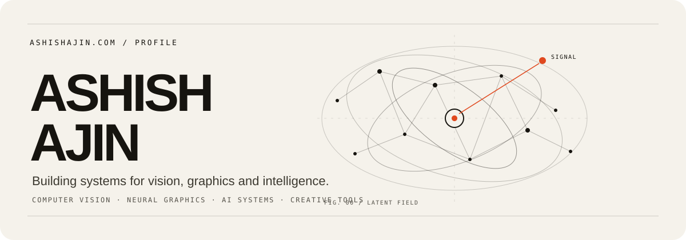
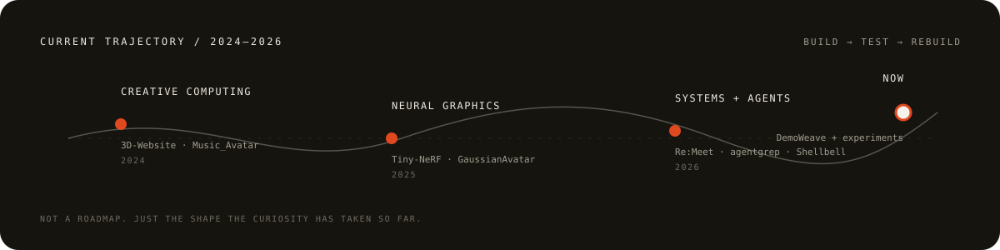
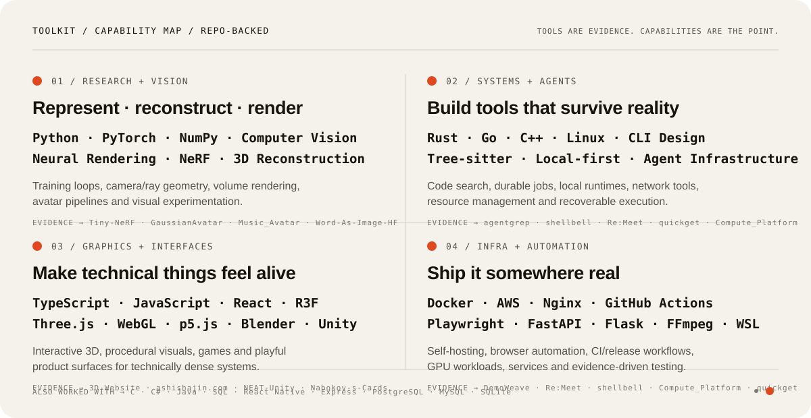
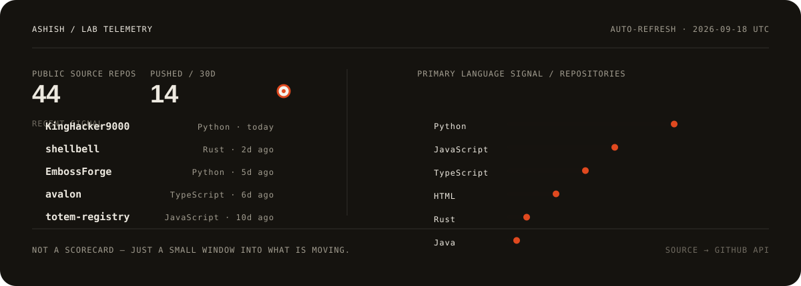

 

I’m a Computer Science student at the **University of Toronto** working around **computer vision, neural graphics, AI systems, and creative developer tools**. I like projects where research ideas have to survive contact with real software.

[**ashishajin.com ↗**](https://ashishajin.com)

### Right now

- `research` — neural rendering, 3D avatars, reconstruction, novel-view synthesis
- `systems` — local-first software, agent infrastructure, tools that are inspectable and recoverable
- `interfaces` — making technical systems feel playful without making them feel like toys

 

### Selected work

<table>
<tr>
<td width="50%" valign="top">
<h3><a href="https://github.com/KingHacker9000/remeet">Re:Meet ↗</a></h3>

A local-first AI meeting companion that captures conversations, screens and live notes, then turns them into searchable decisions, actions and context.

AI SYSTEMS · LOCAL-FIRST · 2026
</td>
<td width="50%" valign="top">
<h3><a href="https://github.com/KingHacker9000/agentgrep">agentgrep ↗</a></h3>

Fast local code radar for coding agents — ranking files, symbols and dependency relationships without putting an LLM in the core search loop.

DEVELOPER TOOLS · RUST · AGENTS · 2026
</td>
</tr>
<tr>
<td width="50%" valign="top">
<h3><a href="https://github.com/KingHacker9000/shellbell">Shellbell ↗</a></h3>

A privacy-first, self-hosted notification system that calls you back when long-running terminal work needs your attention.

SYSTEMS · RUST · SELF-HOSTED · 2026
</td>
<td width="50%" valign="top">
<h3><a href="https://github.com/KingHacker9000/demoweave">DemoWeave ↗</a></h3>

Runtime evidence for agent-authored documentation: inspect the repo, execute declared workflows, capture evidence, track freshness, then safely review and apply docs.

AGENTS · DOCUMENTATION · TOOLING · 2026
</td>
</tr>
</table>

### Toolkit

Not a list of every library I have ever installed. This is the stack and set of capabilities that keeps showing up across the things I actually build.

The map is grounded in the repository history — from PyTorch/NeRF experiments and R3F work to Rust code intelligence, Go networking tools, local AI software, browser automation, CI and self-hosted infrastructure.

<b>Repository trail behind the map</b>

 
<table>
<tr><td><b>Research + vision</b></td><td><a href="https://github.com/KingHacker9000/Tiny-NeRF">Tiny-NeRF</a> · <a href="https://github.com/KingHacker9000/GaussianAvatar">GaussianAvatar</a> · <a href="https://github.com/KingHacker9000/Music_Avatar">Music_Avatar</a> · <a href="https://github.com/KingHacker9000/Word-As-Image-HF">Word-As-Image-HF</a></td></tr>
<tr><td><b>Systems + agents</b></td><td><a href="https://github.com/KingHacker9000/agentgrep">agentgrep</a> · <a href="https://github.com/KingHacker9000/shellbell">shellbell</a> · <a href="https://github.com/KingHacker9000/remeet">Re:Meet</a> · <a href="https://github.com/KingHacker9000/quickget">quickget</a> · <a href="https://github.com/KingHacker9000/demoweave">DemoWeave</a></td></tr>
<tr><td><b>Graphics + interfaces</b></td><td><a href="https://github.com/KingHacker9000/3D-Website">3D-Website</a> · <a href="https://github.com/KingHacker9000/NEAT-Unity">NEAT-Unity</a> · <a href="https://github.com/KingHacker9000/Nabokov-s-Cards">Nabokov-s-Cards</a> · <a href="https://ashishajin.com">ashishajin.com</a></td></tr>
<tr><td><b>Infra + automation</b></td><td><a href="https://github.com/KingHacker9000/Compute_Platform">Compute_Platform</a> · <a href="https://github.com/KingHacker9000/demoweave">DemoWeave</a> · <a href="https://github.com/KingHacker9000/remeet">Re:Meet</a> · <a href="https://github.com/KingHacker9000/shellbell">shellbell</a></td></tr>
</table>

### Lab telemetry

A small automatically refreshed window into what is actually moving on my public GitHub. No streak score, no fake proficiency percentages.

Refreshed nightly from the GitHub API by this profile repository.

### The recurring themes

**Vision / graphics.** I’m interested in machines that can represent, reconstruct and render the visual world — especially neural rendering and avatars.

**Useful AI systems.** I care less about bolting a chat box onto things and more about building the execution, retrieval, evaluation and interface layers that make AI tools dependable.

**Small tools with sharp edges.** CLIs, self-hosted services, weird browser experiments, infrastructure, and things I build because I wanted them to exist.

---

<code>// still making a mess — just with better abstractions.</code>
